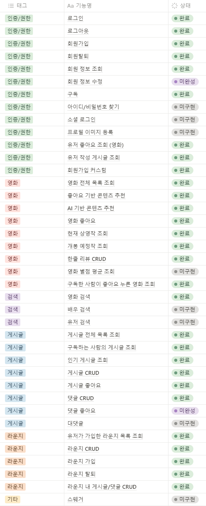
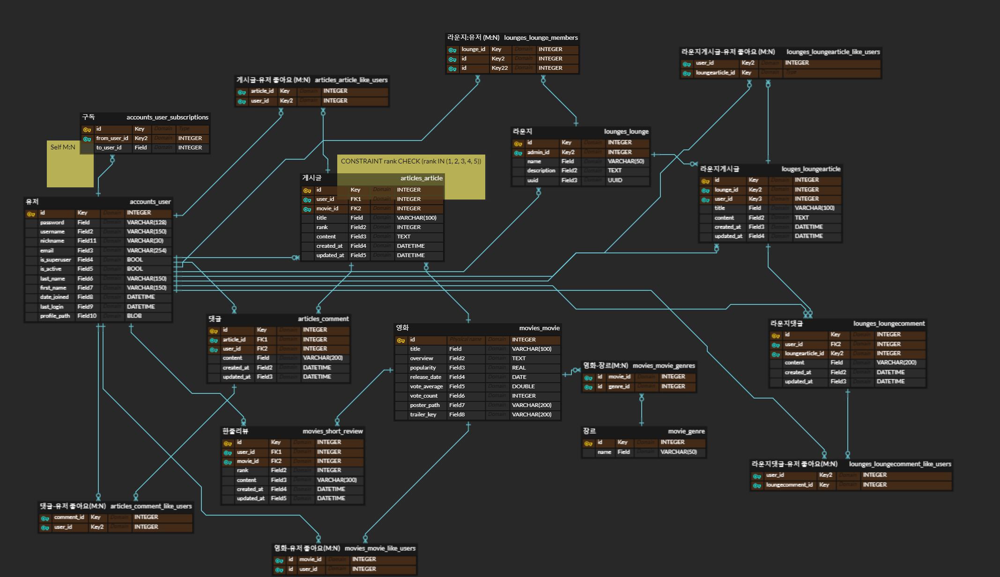

# CinePhile's Lounge
### 팀원 정보 및 업무 분담 내역


| 이름   | 담당                                                    |
|  ------ | ------------------------------------------------------------ |
| 김가람 | 백엔드 (Django) 담당 및 프론트엔드 (Vue.js) 보조  | 
| 임준희 | 프론트엔드 (Vue.js) 담당 및 디자인 & CSS 전반 | 

<br>
<br>

### 목표 서비스 구현 및 실제 구현 정도



<br>
<br>

### 데이터베이스 모델링 (ERD)



<br>
<br>

### 영화 추천 알고리즘에 대한 기술적 설명

- 콘텐츠 기반 필터링 (Contents-based Filtering)
```python
    movies_df['title'] = movies_df['title'].apply(clean_string)
    movies_df['soup'] = movies_df['title'] + ' ' + movies_df['genres']
     
    # CountVectorizer와 TF-IDF(Term Frequency-Inverse Document Frequency)는 둘 다 자연어 처리에서 텍스트 데이터를 수치화하는 데 사용되는 방법
    # TF-IDF는 모든 문서에 공통적으로 나타나는 단어의 중요도를 감소시키므로 여기서는 사용하지 않음
    # 단순히 단어의 출현 빈도만 고려하기 위해 CountVectorizer 사용
    count_vect = CountVectorizer()

    # 주어진 문서 집합에 대해 어휘 사전을 구축(fit)하고 문서를 벡터로 변환(transform)하여 희소 행렬로 반환
    # 그냥 행렬로 처리하면 0이 너무 많아져서 메모리 낭비
    # fit: 각 단어의 인덱스를 매핑
    # transform: 각 문서를 어휘 사전에 등장하는 단어의 출현 빈도로 표현하여 벡터 형태로 반환
    count_matrix = count_vect.fit_transform(movies_df['soup'])

    # 코사인 유사도: 벡터의 길이에 영향을 받지 않고 오직 방향으로만 유사도를 판단 (x벡터와 y벡터가 이루는 각의 코사인 값)
    # 각각의 벡터의 길이(단어의 수)에 가중치를 두지 않고 단순히 단어간의 조합이 비슷함을 판단해야 하므로 코사인 유사도를 사용
    cosine_sim = cosine_similarity(count_matrix, count_matrix)

    # 좋아요 한 영화를 순회하며 각 영화와 비슷한 10개의 영화를 recommended_movies에 넣어줌
    recommended_movies = set()

    # 유저가 좋아요 한 영화가 N개: len(recommended_movies) = N * 10
    for movie in liked_movies:

        # 해당 영화와 전체 영화의 코사인 유사도를 담은 행을 가져옴
        sim_scores = list(enumerate(cosine_sim[movie.id - 1]))

        # 해당 행을 코사인 유사도(x[1])를 기준으로 내림차순으로 정렬함
        # tpl == tuple == (idx, cos_sim)
        sim_scores = sorted(sim_scores, key=lambda tpl: tpl[1], reverse=True)

        # 자기 자신을 제외하고 자기 자신과 가장 비슷한 10개의 영화
        sim_scores = sim_scores[1:11]

        # 중복을 방지하기 위해 set로 넣어줌
        movie_indices = [tpl[0] for tpl in sim_scores]
        for idx in movie_indices: 
            recommended_movies.add(idx + 1)

    return recommended_movies
```

<br>
<br>

### 핵심 기능에 대한 설명

<br>
<br>

### 후기

임준희:
생각보다 재미있었다. 전에는 프론트엔드를 해본적이 없어서 어떤건지 모르고 쉽다고 생각했는데 직접 해보니 더 잘맞고 재미있었다. 디자인도 재미있었고 데이터를 가져와서 재사용 가능한 컴포넌트를 만드는게 재미있었다. 이론으로만 배울때는 재사용성을 어떻게 적용할지 감이 안왔었는데 막상 해보니 같은 컴포넌트 하나로 돌려쓰니까 편하고 좋았다. 또 백엔드와의 협업 방법도 알게 되서 좋았다. 기간이 좀더 길었더라면 좀더 완벽하고 좋은 서비스를 만들수 있었을텐데 그게 아쉽다. 라이프사이클 훅을 조금 안다고 생각했는데 막상 여러 로직이 얽히고 나니 정신없고 풀기가 힘들었다. 다음에는 생명주기를 고려해서 설계부터 확실히 해야겠다.


<br>
<br>

### 개발 일정

| 날짜     | 임준희                                                                                                        | 김가람                                                                                                                                                                |
| -------- | ------------------------------------------------------------------------------------------------------------- | --------------------------------------------------------------------------------------------------------------------------------------------------------------------- |
| 05-16-목 | 와이어 프레임, 요구사항 명세서, <br> navbar 완성, 회원가입 & 로그인 페이지 레이아웃                           | API 명세서, DB 모델링, 프로젝트 셋팅, <br> 요구사항 명세서                                                                                                            |
| 05-17-금 | 회원가입 & 로그인 기능,<br> 메인 페이지 레이아웃 & 디자인                                                     | 장르 & 영화 정보 DB load 기능, <br> 전체 영화 & 현재 상영작 & 개봉 예정작 조회 기능, <br> 영화 상세 조회 기능, 영화 좋아요 기능, <br> 한줄 리뷰 CRUD, 회원가입 커스텀 |
| 05-18-토 | 개봉예정작 컴포넌트 레이아웃 & 디자인 & 기능, <br> 현재 상영작 1,2,3위 조회 컴포넌트 레이아웃 & 디자인 & 기능 | 회원정보 수정 & 삭제, 회원 정보 조회, <br> 게시글 & 댓글 CRUD, 유저 & 영화 & 게시글 구독 및 좋아요                                                                    |
| 05-19-일 | 무비 디테일 조회 기능, <br> 한줄리뷰 CRUD                                                                     | 라운지 CRUD, 좋아요 기반 추천 알고리즘                                                                                                                                |
| 05-20-월 | 무비 디테일, 한줄리뷰 레이아웃 & 디자인, <br>피드 기능(미완성)                                                | 검색기능, 날씨 기반 추천 알고리즘 (미완성)                                                                                                                            |
| 05-21-화 | 피드 기능 완성, 피드 레이아웃 & 디자인, <br> 게시글 디테일 기능 & 레이아웃 & 디자인                           | 날씨 기반 추천 알고리즘 완성, <br> 마이 페이지 및 라운지 가입 / 생성 화면 구현, <br> 라운지 리스트 페이지 및 컴포넌트 구현                                            |
| 05-22-수 | 좋아요 기반, 구독 기반, 장르별, 최신 영화 추천 기능 & 레이아웃 & 디자인, <br> 스포일러 댓글 블러 기능, <br> 회원가입시 관심 영화 선택 레이아웃 & 디자인 | 라운지 기능 백엔드 및 프론트엔드 구현 (게시글 및 댓글 CRUD), <br> DB 모델 변경, 마이페이지 리팩터링                                                                   |
| 05-23-목 | 회원가입 시 영화 선택창, <br> 라운지 디자인, 검색 기능 구현 및 디자인  | 날씨 기반 추천 화면 구현 & 데이터 파싱 로직 수정, <br>  유저 조회 페이지 리팩터링 |
