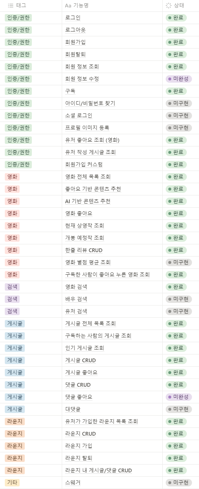
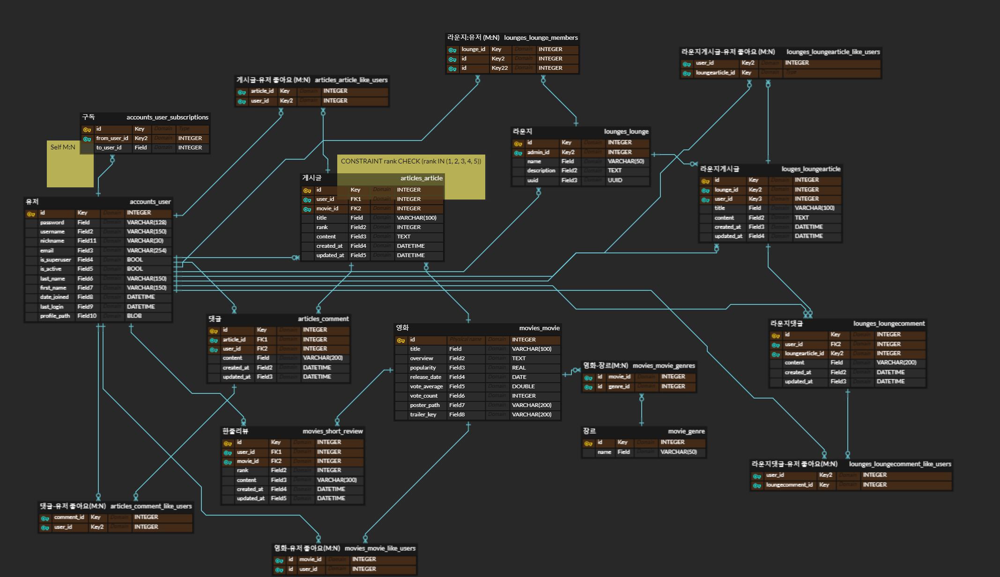
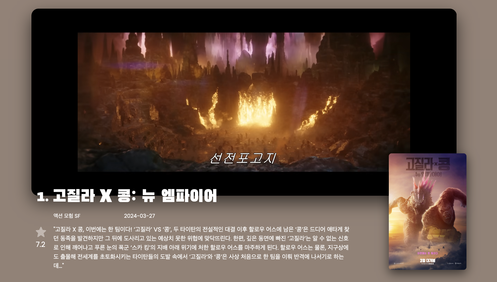
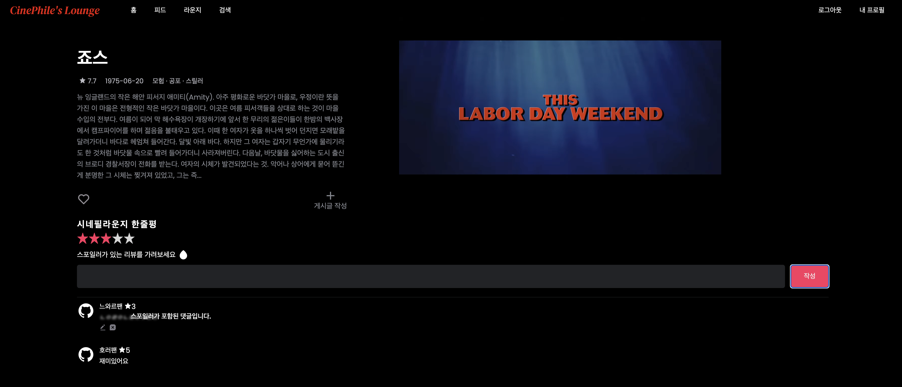
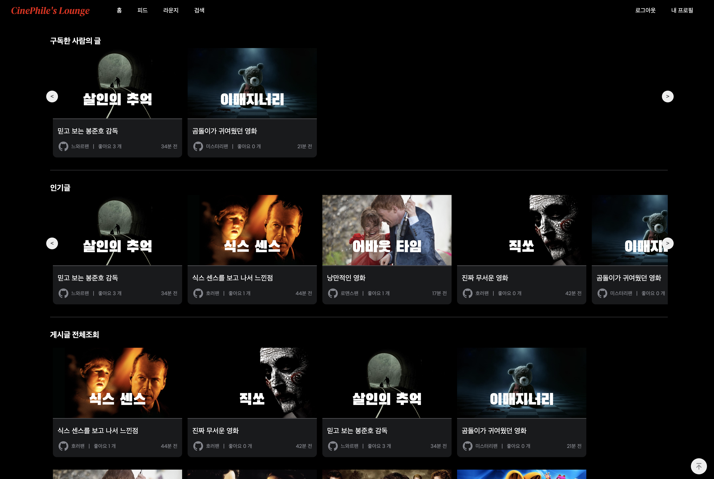
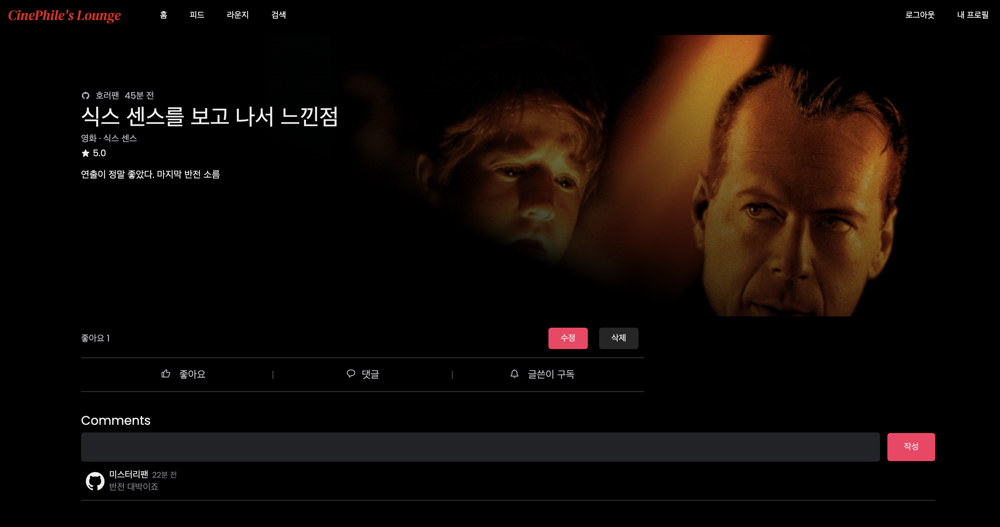
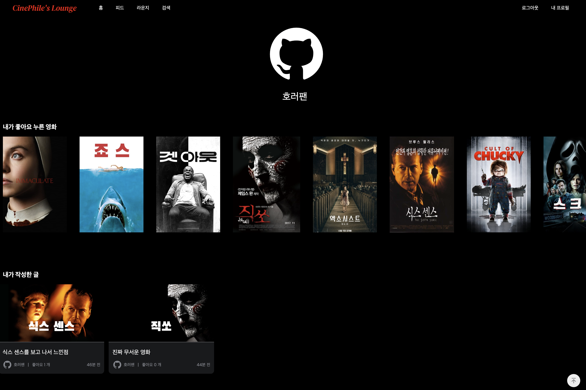
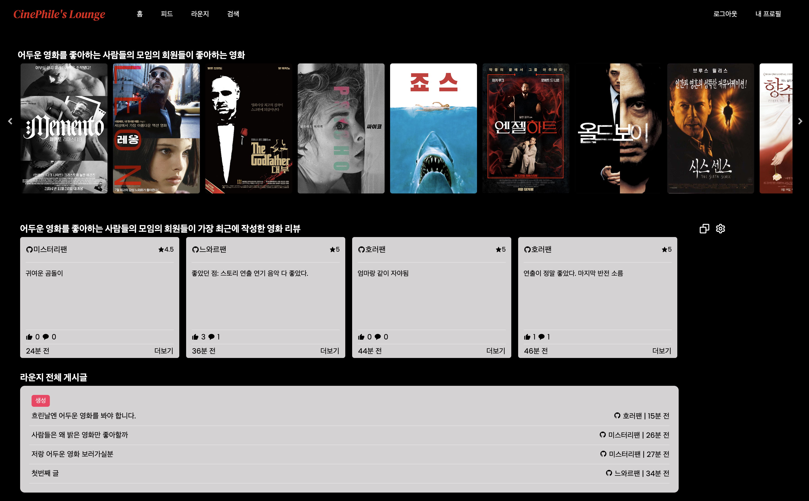
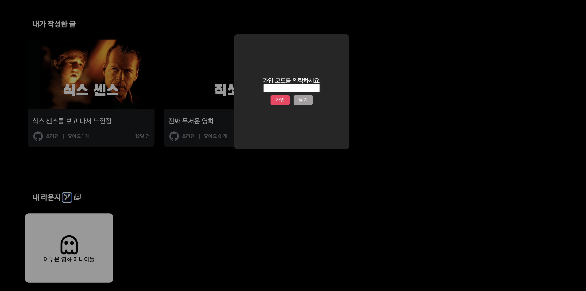
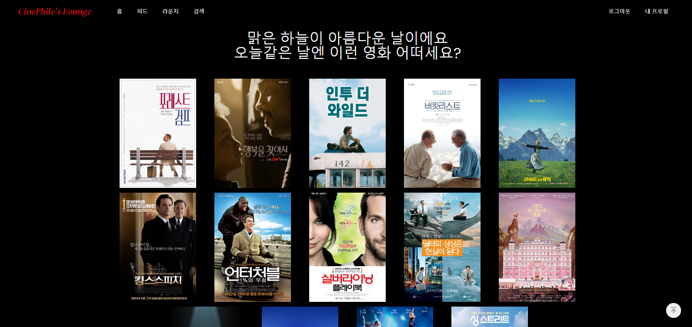

# CinePhile's Lounge

`CinePhile's Lounge`는 영화 데이터 조회와 검색, 한줄평 & 리뷰 작성 서비스와 더불어 취향이 비슷한 유저들끼리 프라이빗하게 모여 영화와 리뷰를 공유할 수 있는 `라운지`라는 편안한 공간을 제공합니다.

<br>
<br>

## 팀원 정보 및 업무 분담 내역

| 이름   | 담당                                             |
| ------ | ------------------------------------------------ |
| 김가람 | 백엔드 (Django) 담당 및 프론트엔드 (Vue.js) 보조 |
| 임준희 | 프론트엔드 (Vue.js) 담당 및 디자인 & CSS 전반    |

<br>
<br>

## 목표 서비스 구현 및 실제 구현 정도



<br>
<br>

## 데이터베이스 모델링 (ERD)



<br>
<br>

## 영화 추천 알고리즘

### 콘텐츠 기반 필터링 (Contents-based Filtering) 알고리즘

- 사용자가 선호하는 아이템과 비슷한 아이템을 선별하여 추천한다.
- 각 아이템들을 벡터로 표현한 후 유저가 선호하는 아이템과의 유사도를 도출하여 해당 유사도가 높은 아이템을 골라 사용자에게 추천하는 방식이다.

```python
    # 영화의 제목과 장르를 단어 단위로 끊어서 한 문장으로 만든다
    movies_df['soup'] = movies_df['title'] + ' ' + movies_df['genres']

    count_vect = CountVectorizer()

    # 영화들의 속성을 담은 문장을 토큰화한 후 벡터로 변환하여 코사인 유사도를 도출한다
    count_matrix = count_vect.fit_transform(movies_df['soup'])
    cosine_sim = cosine_similarity(count_matrix, count_matrix)

    recommended_movies = []
    for movie in liked_movies:
        # 해당 영화와 전체 영화간의 코사인 유사도를 담은 행을 가져온다
        sim_scores = list(enumerate(cosine_sim[movie.id - 1]))

        # 해당 행을 코사인 유사도(tpl[1])를 기준으로 내림차순으로 정렬함
        # tpl == tuple == (idx, cos_sim)
        sim_scores = sorted(sim_scores, key=lambda tpl: tpl[1], reverse=True)

        # 자기 자신을 제외하고 자기 자신과 가장 비슷한 10개의 영화
        sim_scores = sim_scores[1:11]
        recommended_movies.add(sim_scores)

    return recommended_movies
```

<br>

### 날씨 기반 추천 알고리즘 (AI 사용)

- 사용자의 위치 정보를 통해 `OpenWeatherAPI`로 날씨를 불러오고, 해당 날씨에 알맞는 영화를 `OpenAI`를 통해 추천받는다.
- 추천 결과의 영화 제목들을 파라미터로 사용하여 TMDB 검색 API로 넘겨서 요청을 보낸다.
- 검색 결과로 반환된 영화의 `id`값을 가져와 서비스에서 활용할 수 있도록 DB에서 찾아 반환한다.

```python
def recommend_by_weather(weather_id):

    weather_message = ""
    recommend_conditions = ""

    if weather_id < 300:
        # Thunderstorm (2XX)
        weather_message = "천둥 번개가 몰려와요"
        recommend_conditions = """
            1. 장르: 액션, SF, 스릴러, 전쟁
            2. 빠른 전개와 웅장한 음악, 화려한 장면
        """
    elif weather_id < 600:
        ...

    client = OpenAI(
        api_key=settings.OPEN_API_KEY
    )

    completion = client.chat.completions.create(
        model="gpt-3.5-turbo",
        messages=[
            {
                "role": "user",
                "content": f"""
                아래 조건을 만족하는 영화 15개를 추천해줘
                {recommend_conditions}
                ...
                ...
                """,
            },
        ],
    )

    recommended_movies = []

    for movie_title in response:
        # 1. ChatGPT의 reponse에 담긴 영화 이름으로 TMDB에 검색 요청을 보낸다
        url = f"https://api.themoviedb.org/3/search/movie?query={movie_title}&include_adult=true&language=ko-KR&page=1"
        # 2. 결과의 맨 첫번째 있는 영화를 가져온 후 DB에서 해당 id와 매치되는 인스턴스를 가져와 서비스에 사용할 수 있도록 반환한다
        response = requests.get(url)
        if response:
            result_movie = response[0]
            recommended_movies.append(result_movie)

    return weather_message, recommended_movies
```

<br>
<br>

## 핵심 기능

### 메인화면

- 콘텐츠 기반 필터링으로 유저가 좋아할 만한 영화 추천
- 장르별, 개봉날짜 등의 기준으로 다양한 영화 추천




<br>
<br>

### 영화 정보 상세 조회

- 영화 좋아요 및 한줄평 CRUD
- 스포일러 댓글을 미리 체크하여 블러처리 할 수 있음
- 게시글 작성 버튼을 클릭하면 리뷰 작성 페이지로 이동



<br>
<br>

### 피드 리스트 조회

- 구독한 사람의 게시글 불러올 수 있음
- 인기글은 게시글을 좋아요 + 댓글 수 기준으로 정렬된 정보를 불러옴



<br>
<br>

### 게시글 상세 조회

- 영화 게시글 좋아요 및 CRUD
- 글쓴이 구독할 수 있음 (자기 자신은 구독 불가)



<br>
<br>

### 유저 정보 조회

- 내가 좋아요 누른 영화 및 작성한 글 조회



<br>
<br>

- 내가 가입한 라운지 조회
- 라운지 란 제목 우측의 버튼을 통해 라운지 가입, 생성 가능
  

<br>
<br>

### 라운지 정보 조회

- 라운지 회원들의 영화 및 게시글을 불러옴
- 라운지 내의 프라이빗한 게시판에 게시글 및 댓글 작성 가능



<br>
<br>

- 우측 포스터 밑의 버튼으로 라운지 정보 조회나 라운지 가입 인증 코드 복사 가능


<br>
<br>

- 해당 코드는 내 프로필 페이지에서 입력하여 프라이빗한 라운지에 가입할 수 있음



<br>
<br>

### 영화 검색

- 검색창의 텍스트가 변경될 때마다 POST 요청을 보내 영화 제목 및 줄거리에 키워드를 포함한 영화들을 불러와 렌더링


<br>
<br>

### 날씨 기반 추천 알고리즘

- 우측 상단의 분홍색 버튼을 누르면 로딩 모달이 팝업됨과 동시에 axios 요청으로 현재 위치 정보를 보내어 날씨 기반 추천 함수 구동
- 추천이 끝나면 새로운 영화 목록 페이지로 렌더링 되어 포스터 클릭 시 영화 디테일 페이지 이동 가능하도록 구현




  <br>
  <br>

## 후기

- 임준희

프론트엔드는 해본적이 없어서 어떨지 궁금했는데 직접 해보니 더 잘맞고 재미있었다. 디자인하는 것도 재미있었고 컴포넌트를 구현하는 과정도 재미있었다. 특히 컴포넌트와 관련해서, 이론으로만 배울때는 재사용성의 중요성이 실감이 잘 나지 않았는데 막상 직접 개발을 해보니 하나의 컴포넌트를 재사용함으로써 직접 효율성을 경험할 수 있어서 놀라웠다. 백엔드와의 협업 방법도 알게 되서 좋았다. 다만 기간이 좀더 길었더라면 좀더 완벽하고 좋은 서비스를 만들수 있었을텐데 조금 아쉽다. 또 라이프사이클 훅을 조금 안다고 생각했는데 막상 여러 로직이 얽히고 나니 정신없고 풀기가 힘들었다. 다음에는 생명주기를 고려해서 설계부터 확실히 해야겠다.

<br>

- 김가람

개발을 배우고 나서 처음으로 해본 협업이라 긴장이 많이 됐다. 프론트 측의 원활한 작업을 위해 백엔드를 최대한 빨리 구현하려고 코드를 후루룩 썼는데, 나중에 비효율성이나 버그 수정때문에 그 코드를 다시 보며 리팩터링을 하는 과정에서 큰 흥미를 느꼈다. DB에 반복적으로 접근하는 코드를 ORM을 사용하여 효율적으로 고쳤을 때의 희열감이 생생하다. 좀 더 장고에 대해 알고싶고, 더 좋은 쿼리, 더 효율적인 코드를 쓰고 싶었는데 기간이 짧은 것이 아쉽다. 설계의 중요성 또한 실감했다. 데드라인을 맞추기 위해 최대한 빨리 기획을 하고 바로 개발에 뛰어들었는데, 후반부에 계획이 구체적이지 못했던 부분을 구현하며 조금 진땀을 흘렸다. 계획은 구체적일수록 좋다는 사실을 이번 기회를 통해 깨닫게 되었다.

<br>

<br>
<br>

## 개발 일정

| 날짜     | 임준희                                                                                                                                                  | 김가람                                                                                                                                                                |
| -------- | ------------------------------------------------------------------------------------------------------------------------------------------------------- | --------------------------------------------------------------------------------------------------------------------------------------------------------------------- |
| 05-16-목 | 와이어 프레임, 요구사항 명세서, <br> navbar 완성, 회원가입 & 로그인 페이지 레이아웃                                                                     | API 명세서, DB 모델링, 프로젝트 셋팅, <br> 요구사항 명세서                                                                                                            |
| 05-17-금 | 회원가입 & 로그인 기능,<br> 메인 페이지 레이아웃 & 디자인                                                                                               | 장르 & 영화 정보 DB load 기능, <br> 전체 영화 & 현재 상영작 & 개봉 예정작 조회 기능, <br> 영화 상세 조회 기능, 영화 좋아요 기능, <br> 한줄 리뷰 CRUD, 회원가입 커스텀 |
| 05-18-토 | 개봉예정작 컴포넌트 레이아웃 & 디자인 & 기능, <br> 현재 상영작 1,2,3위 조회 컴포넌트 레이아웃 & 디자인 & 기능                                           | 회원정보 수정 & 삭제, 회원 정보 조회, <br> 게시글 & 댓글 CRUD, 유저 & 영화 & 게시글 구독 및 좋아요                                                                    |
| 05-19-일 | 무비 디테일 조회 기능, <br> 한줄리뷰 CRUD                                                                                                               | 라운지 CRUD, 좋아요 기반 추천 알고리즘                                                                                                                                |
| 05-20-월 | 무비 디테일, 한줄리뷰 레이아웃 & 디자인, <br>피드 기능(미완성)                                                                                          | 검색기능, 날씨 기반 추천 알고리즘 (미완성)                                                                                                                            |
| 05-21-화 | 피드 기능 완성, 피드 레이아웃 & 디자인, <br> 게시글 디테일 기능 & 레이아웃 & 디자인                                                                     | 날씨 기반 추천 알고리즘 완성, <br> 마이 페이지 및 라운지 가입 / 생성 화면 구현, <br> 라운지 리스트 페이지 및 컴포넌트 구현                                            |
| 05-22-수 | 좋아요 기반, 구독 기반, 장르별, 최신 영화 추천 기능 & 레이아웃 & 디자인, <br> 스포일러 댓글 블러 기능, <br> 회원가입시 관심 영화 선택 레이아웃 & 디자인 | 라운지 기능 백엔드 및 프론트엔드 구현 (게시글 및 댓글 CRUD), <br> DB 모델 변경, 마이페이지 리팩터링                                                                   |
| 05-23-목 | 회원가입 시 영화 선택창, <br> 라운지 디자인, 검색 기능 구현 및 디자인                                                                                   | 날씨 기반 추천 화면 구현 & 데이터 파싱 로직 수정, <br> 유저 조회 페이지 리팩터링                                                                                      |
